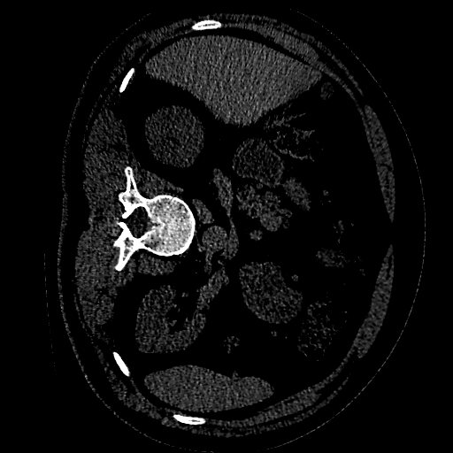
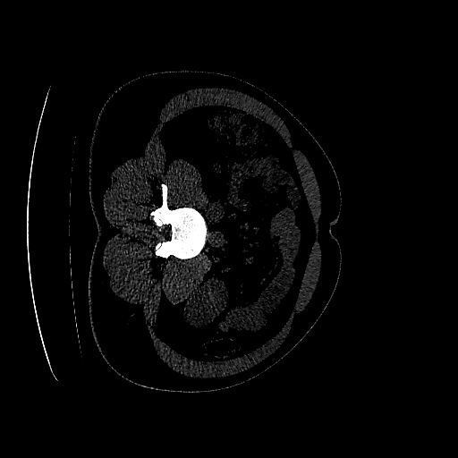
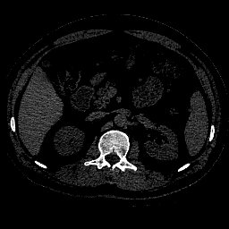
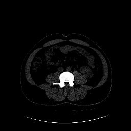

# Identification of COVID-19 cases using a 3D Bi-LSTM Classifier for Chest CT scans

All the Chest CT scans are taken from the [MosMedData](https://www.medrxiv.org/content/10.1101/2020.05.20.20100362v1) dataset.

|            | CT-0 | CT-23 |
|------------|------|-------|
| Raw (512x512) |  |  |
| Normalized (256x256 + Depthness 64) |  |  |

## References

MosMedData: Chest CT Scans with COVID-19 Related Findings Dataset

```bibtex
@article {Morozov2020.05.20.20100362,
author = {Morozov, S.P. and Andreychenko, A.E. and Pavlov, N.A. and Vladzymyrskyy, A.V. and Ledikhova, N.V. and Gombolevskiy, V.A. and Blokhin, I.A. and Gelezhe, P.B. and Gonchar, A.V. and Chernina, V.Yu.},
title = {MosMedData: Chest CT Scans with COVID-19 Related Findings Dataset},
elocation-id = {2020.05.20.20100362},
year = {2020},
doi = {10.1101/2020.05.20.20100362},
publisher = {Cold Spring Harbor Laboratory Press},
abstract = {This dataset contains anonymised human lung computed tomography (CT) scans with COVID-19 related findings, as well as without such findings. A small subset of studies has been annotated with binary pixel masks depicting regions of interests (ground-glass opacifications and consolidations). CT scans were obtained between 1st of March, 2020 and 25th of April, 2020, and provided by municipal hospitals in Moscow, Russia. Permanent link:https://mosmed.ai/datasets/covid19_1110. This dataset is licensed under a Creative Commons Attribution-NonCommercial-NoDerivs 3.0 Unported (CC BY-NC-ND 3.0) License.Competing Interest StatementThe authors have declared no competing interest.Funding StatementNo external fundingAuthor DeclarationsI confirm all relevant ethical guidelines have been followed, and any necessary IRB and/or ethics committee approvals have been obtained.YesAll necessary patient/participant consent has been obtained and the appropriate institutional forms have been archived.YesI understand that all clinical trials and any other prospective interventional studies must be registered with an ICMJE-approved registry, such as ClinicalTrials.gov. I confirm that any such study reported in the manuscript has been registered and the trial registration ID is provided (note: if posting a prospective study registered retrospectively, please provide a statement in the trial ID field explaining why the study was not registered in advance).YesI have followed all appropriate research reporting guidelines and uploaded the relevant EQUATOR Network research reporting checklist(s) and other pertinent material as supplementary files, if applicable.Yeshttps://mosmed.ai/static/landing/docx/README_RU.pdf},
URL = {https://www.medrxiv.org/content/early/2020/05/22/2020.05.20.20100362},
eprint = {https://www.medrxiv.org/content/early/2020/05/22/2020.05.20.20100362.full.pdf},
journal = {medRxiv}
}
```
